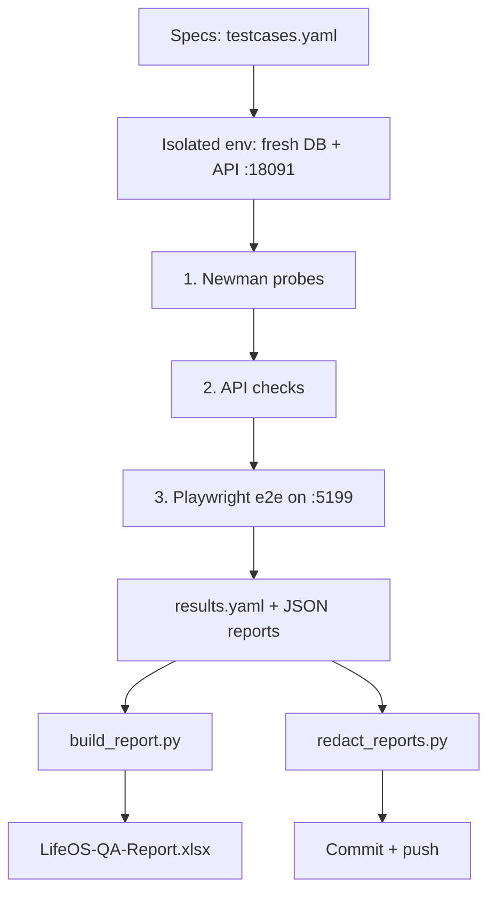

# lifeos-qa

QA portfolio untuk LifeOS — test plan, 61 test cases, eksekusi ber-evidence,
4 bug report nyata (semua Fixed), Newman API suite, Playwright e2e, laporan Excel.

## Purpose, Output & Expectations

**Purpose.** A personal app with 13 pages and 30+ endpoints cannot be trusted
on developer testing alone — especially with no production deployment to learn
from. This repo proves LifeOS quality with evidence instead of claims.

**Output.** A test plan, 61 test cases (100% executed with evidence), 4 real
bug reports (all fixed and re-verified), a 75-assertion Newman API suite, 26
Playwright end-to-end tests, and a 5-sheet Excel report generated from data —
plus secret hygiene (tokens redacted, passwords via env).

**Expectations.** After reading: any selected test case can be traced to its
evidence (API log, screenshot, or report row); every bug links to its fix
commit; the full run is reproducible locally in documented order.

## Features

| Feature | Description |
|---|---|
| Test plan | - Scope (13 pages + API), approach (manual + automation), entry/exit criteria, risks (fixed seed dates vs drifting today). - Purpose: define what "done" means before testing. Output: agreed scope and gates. |
| Test cases | - 61 cases in YAML (functional, boundary, negative, UI, automation) with IDs, steps, expectations. - Purpose: single source of truth. Output: machine-readable spec feeding the report. |
| Bug reports | - 4 real bugs with repro steps, severity, and resolution (PUT full-replace, dashboard `_ts` leak, raw gin errors, labels without `htmlFor`). - Purpose: findings with proof, not opinions. Output: Fixed + re-verified. |
| Newman suite | - Reuses the API collection: register-block, login→token, full module flow + cleanup. - Purpose: automated API regression. Output: 75/75 assertions. |
| Playwright e2e | - 26 tests (Chromium headless): auth, critical flows, page coverage incl. heatmap and label-association proof. - Purpose: prove the UI works for a human. Output: green run + failure screenshots. |
| Excel report | - Generated via openpyxl (never hand-edited): Cover, Cases, Execution Log, Bugs, Summary with COUNTIF + chart. - Purpose: recruiter-readable evidence. Output: `LifeOS-QA-Report.xlsx`. |
| Hygiene | - `redact_reports.py`: strips tokens/bodies/absolute paths before every commit. - Purpose: public repo without leaking test secrets. Output: 0 secrets in tracked files. |

## How It Works



## Hasil (run 2026-09-15, env terisolasi)

| Suite | Hasil |
|---|---|
| Test cases | 61/61 Pass |
| Newman API (`lifeos` collection) | 75/75 assertions |
| Playwright e2e (Chromium headless) | 26/26 |
| `go test` + swagger validate | Pass, service 83.4% |
| Bug terbuka | 0 (4 Fixed) |

Laporan utama: [`reports/LifeOS-QA-Report.xlsx`](reports/LifeOS-QA-Report.xlsx)
(Cover, Test Cases, Execution Log, Bug Reports, Summary + grafik —
generate via `tools/build_report.py`, jangan edit manual).

## Struktur

```
test-plan.md          # scope, pendekatan, kriteria masuk/keluar
data/testcases.yaml   # 56 kasus (sumber kebenaran)
data/bugs.yaml        # 4 bug nyata + repro
data/results.yaml     # hasil run API (generate)
tools/build_report.py # generate XLSX (openpyxl)
e2e/                  # Playwright TS (auth, flows, ui, ui2)
reports/              # newman.json, playwright.json, XLSX
```

## Cara run (urutan penting — isolasi!)

```bash
# 1. DB fresh + API uji (jangan pakai DB live!)
rm -f /tmp/qa-test.db
goose -dir ../lifeos/migrations sqlite /tmp/qa-test.db up
sqlite3 /tmp/qa-test.db < ../lifeos/seed/seed.sql
PORT=18091 JWT_SECRET=qa-secret DB_PATH=/tmp/qa-test.db \
  FRONTEND_URL=http://localhost:5199 /tmp/qa-api &

# 2. Newman DULU (probe create+delete, sensitif urutan)
npx newman run ../lifeos/api/postman_collection.json \
  --env-var baseUrl=http://localhost:18091

# 3. API checks, 4. e2e (webServer otomatis :5199)
python3 /tmp/qa_run.py   # → data/results.yaml (skrip di repo? tidak — ad-hoc)
cp .env.example .env 2>/dev/null; export $(cat .env 2>/dev/null | grep QA_ | xargs) 2>/dev/null
cd e2e && npx playwright test

# 5. Generate laporan + sanitasi sebelum commit
python3 tools/build_report.py
python3 tools/redact_reports.py   # hapus token/bodies newman, path absolut playwright
```

## Hygiene

* Kredensial demo (`aku@lifeos.local`) di dokumen adalah akun fiktif sekali pakai
  (publik by design, sama seperti README `lifeos`). Password hanya via env
  `QA_PASSWORD` (lihat `e2e/.env.example`) — tak ada literal di kode.
* `reports/newman.json` + `playwright.json` selalu lewat `redact_reports.py`
  sebelum commit (token, body, path mesin uji).
* `shiftbase` + `shiftbase-web` teraudit bersih: tanpa token/path pribadi
  (hanya kredensial demo + password throwaway lokal-CI).

## Bug temuan (ringkas)

* BUG-001 (Medium): PUT full-replace hapus field tak dikirim — by design, UI kirim penuh.
* BUG-002 (Low): `GET /dashboard` bocorkan field internal `_ts`.
* BUG-003 (Low): pesan validasi gin mentah bocor ke UI.
* BUG-004 (Low): label form tanpa `htmlFor` — asosiasi label-input tak valid, automation flaky.
